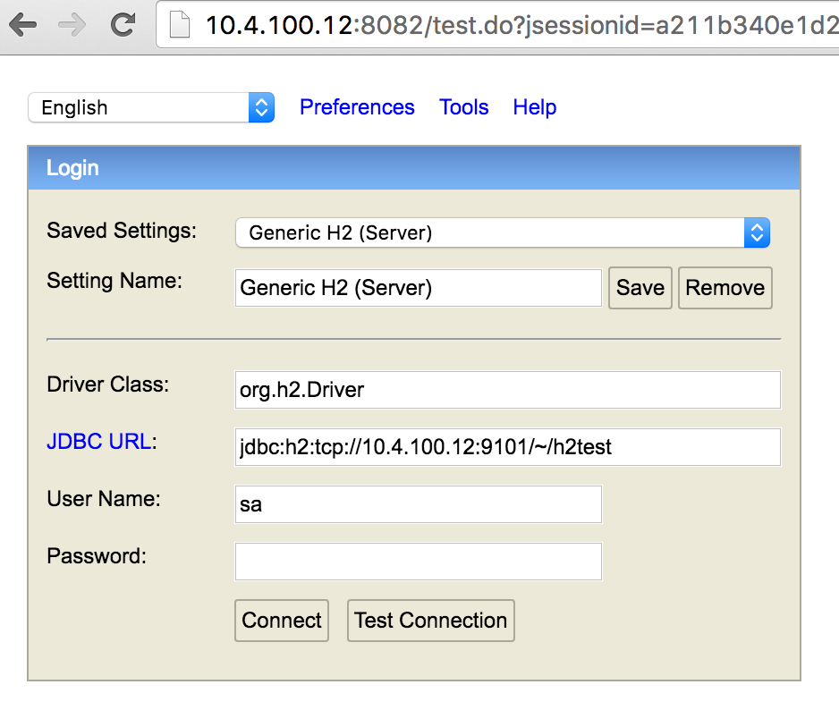
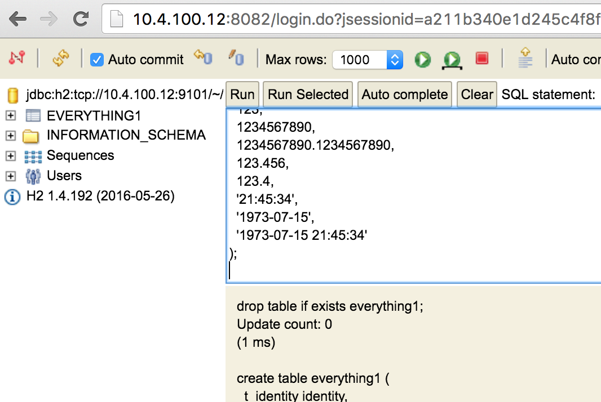
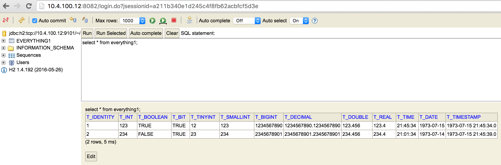

========================
jdbc-datasource-template
========================

A Java micro service template for proxying JDBC tables and queries as a JSON entity stream to a Sesam service instance.

.. contents:: **Table of Contents**

The configuration file
----------------------

The service takes a configuration file called config.json. There is one such file provided with this project:

::
   
  {
      "h2test": {
          "jdbc-url": "jdbc:h2:tcp://10.4.100.12:9101/~/h2test/foo",
          "username": "sa",
          "sources": {
              "everything1": {
                  "query": "select * from everything1",
                  "since": "where t_timestamp > ${since}",
                  "updated-column": "T_TIMESTAMP",
                  "primary-key": ["T_IDENTITY", "T_INT"]
              }
          }
      }
  }

Using the H2 database server
----------------------------

Download the H2 database jar file:

::

  $ curl -s -o h2.jar 'https://repo1.maven.org/maven2/com/h2database/h2/1.4.192/h2-1.4.192.jar'

Start the H2 database server:

::

  $ java -cp h2.jar org.h2.tools.Server -web -tcp -tcpPort 9101 -tcpAllowOthers
  TCP server running at tcp://10.4.100.12:9101 (others can connect)
  Web Console server running at http://10.4.100.12:8082 (only local connections)

Next, open the H2 Web Console. See actual link above. Enter the data provided below, but make sure that the IP is the one of your own computer.

Now you should be logged in and you should see the H2 Web Console:

Next we'll create the ``everything1`` database table and add two rows to it. Paste the DDL and SQL statements below into the textarea and click the ``Run`` button.

::

  drop table if exists everything1;
  create table everything1 (
    t_identity identity,
    t_int int,
    t_boolean boolean,
    t_bit bit,
    t_tinyint tinyint,
    t_smallint smallint,
    t_bigint bigint,
    t_decimal decimal,
    t_double double,
    t_real real,
    t_time time,
    t_date date,
    t_timestamp timestamp 
  );
  insert into everything1 (
    t_int,
    t_boolean,
    t_bit,
    t_tinyint,
    t_smallint,
    t_bigint,
    t_decimal,
    t_double,
    t_real,
    t_time,
    t_date,
    t_timestamp
  ) values (
    123,
    true,
    1,
    12,
    123,
    1234567890,
    1234567890.1234567890,
    123.456,
    123.4,
    '21:45:34',
    '1973-07-15',
    '1973-07-15 21:45:34'
  );
  insert into everything1 (
    t_int,
    t_boolean,
    t_bit,
    t_tinyint,
    t_smallint,
    t_bigint,
    t_decimal,
    t_double,
    t_real,
    t_time,
    t_date,
    t_timestamp
  ) values (
    234,
    false,
    2,
    23,
    234,
    2345678901,
    2345678901.2345678901,
    234.456,
    234.4,
    '21:01:34',
    '1973-07-14',
    '1973-07-15 21:45:39'
  );

You should now be able to see that there is data in the ``everything1`` table:

Running the JDBC proxy service
------------------------------

Build the service using Maven:

::

  $ mvn clean package

Start the service.

::

  $ mvn exec:java
  [INFO] Scanning for projects...
  [INFO]
  [INFO] ------------------------------------------------------------------------
  [INFO] Building java-datasource-template 1.0-SNAPSHOT
  [INFO] ------------------------------------------------------------------------
  [INFO]
  [INFO] --- exec-maven-plugin:1.5.0:java (default-cli) @ java-datasource-template ---
  [Thread-1] INFO org.eclipse.jetty.util.log - Logging initialized @1405ms
  [Thread-1] INFO spark.embeddedserver.jetty.EmbeddedJettyServer - == Spark has ignited ...
  [Thread-1] INFO spark.embeddedserver.jetty.EmbeddedJettyServer - >> Listening on 0.0.0.0:4567
  [Thread-1] INFO org.eclipse.jetty.server.Server - jetty-9.3.6.v20151106
  [Thread-1] INFO org.eclipse.jetty.server.ServerConnector - Started ServerConnector@2b17199d{HTTP/1.1,[http/1.1]}{0.0.0.0:4567}
  [Thread-1] INFO org.eclipse.jetty.server.Server - Started @1473ms

The service listens on port 4567. JSON entities can be retrieved from 'http://localhost:4567/h2test/everything1'.

::

  $ curl -s 'http://localhost:4567/h2test/everything1' | python3 -m json.tool
  [
      {
          "_id": "1:123",
          "_updated": "1973-07-15 21:45:34.0",
          "T_IDENTITY": 1,
          "T_INT": 123,
          "T_BOOLEAN": true,
          "T_BIT": true,
          "T_TINYINT": 12,
          "T_SMALLINT": 123,
          "T_BIGINT": 1234567890,
          "T_DECIMAL": 1234567890.1234567,
          "T_DOUBLE": 123.456,
          "T_REAL": 123.4000015258789,
          "T_TIME": "21:45:34",
          "T_DATE": "~t1973-07-15",
          "T_TIMESTAMP": "~t1973-07-15T20:45:34Z"
      },
      {
          "_id": "2:234",
          "_updated": "1973-07-15 21:45:39.0",
          "T_IDENTITY": 2,
          "T_INT": 234,
          "T_BOOLEAN": false,
          "T_BIT": true,
          "T_TINYINT": 23,
          "T_SMALLINT": 234,
          "T_BIGINT": 2345678901,
          "T_DECIMAL": 2345678901.234568,
          "T_DOUBLE": 234.456,
          "T_REAL": 234.39999389648438,
          "T_TIME": "21:01:34",
          "T_DATE": "~t1973-07-14",
          "T_TIMESTAMP": "~t1973-07-15T20:45:39Z"
      }
  ]
  
::

  $ curl -s 'http://localhost:4567/h2test/everything1?since=1973-07-15%2021:45:34.0' | python3 -m json.tool
  [
      {
          "_id": "2:234",
          "_updated": "1973-07-15 21:45:39.0",
          "T_IDENTITY": 2,
          "T_INT": 234,
          "T_BOOLEAN": false,
          "T_BIT": true,
          "T_TINYINT": 23,
          "T_SMALLINT": 234,
          "T_BIGINT": 2345678901,
          "T_DECIMAL": 2345678901.234568,
          "T_DOUBLE": 234.456,
          "T_REAL": 234.39999389648438,
          "T_TIME": "21:01:34",
          "T_DATE": "~t1973-07-14",
          "T_TIMESTAMP": "~t1973-07-15T20:45:39Z"
      }
  ]

Docker
------

There is a Dockerfile provided in this project, so it is pretty easy to build a Docker image and run that instead.

::

  $ docker build -t yourid/yourimage:latest .
  Sending build context to Docker daemon 7.296 MB
  Step 1 : FROM java:8-jre-alpine
   ---> cc37a2b2511d
  Step 2 : ADD target/jdbc-datasource-template-1.0-SNAPSHOT.jar /srv/
   ---> 81a049ca7fec
  Removing intermediate container 017af0a71bf3
  Step 3 : ENTRYPOINT java -jar /srv/jdbc-datasource-template-1.0-SNAPSHOT.jar
   ---> Running in 377ce22a1b51
   ---> a217126b691e
  Removing intermediate container 377ce22a1b51
  Step 4 : CMD /config.json
   ---> Running in 85bf0700b65e
   ---> 41cc605bd267
  Removing intermediate container 85bf0700b65e
  Successfully built 41cc605bd267
  
You can then start a Docker container using it like this:

::

  $ docker run -it -p 4567:4567 -v $PWD/config.json:/config.json yourid/your-image:latest
  [main] INFO io.sesam.datasources.App - Loading configuration from: /config.json
  [main] INFO com.zaxxer.hikari.HikariDataSource - HikariPool-1 - Started.
  [Thread-1] INFO org.eclipse.jetty.util.log - Logging initialized @839ms
  [Thread-1] INFO spark.embeddedserver.jetty.EmbeddedJettyServer - == Spark has ignited ...
  [Thread-1] INFO spark.embeddedserver.jetty.EmbeddedJettyServer - >> Listening on 0.0.0.0:4567
  [Thread-1] INFO org.eclipse.jetty.server.Server - jetty-9.3.z-SNAPSHOT
  [Thread-1] INFO org.eclipse.jetty.server.ServerConnector - Started ServerConnector@2f6503f1{HTTP/1.1,[http/1.1]}{0.0.0.0:4567}
  [Thread-1] INFO org.eclipse.jetty.server.Server - Started @949ms
